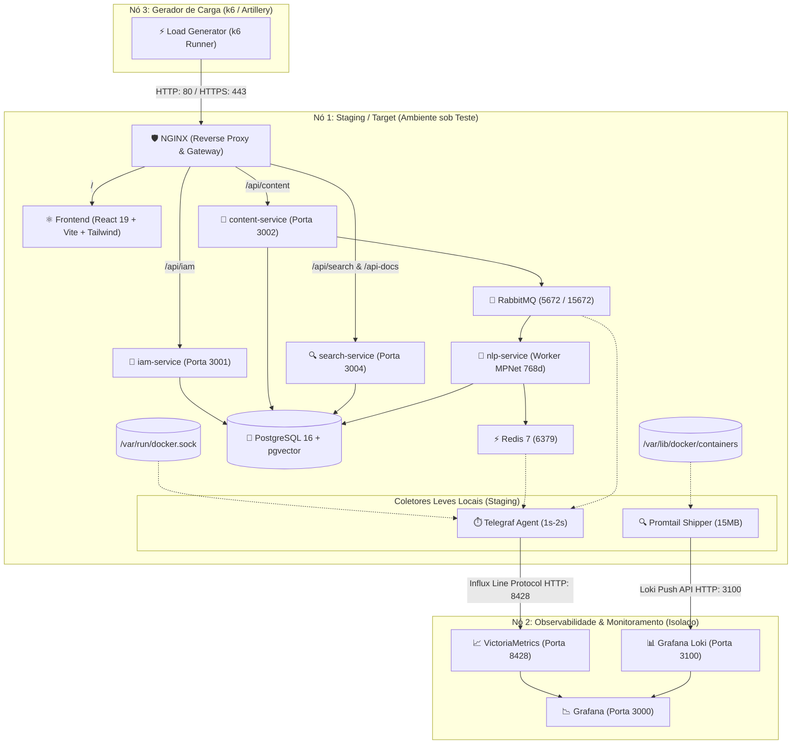
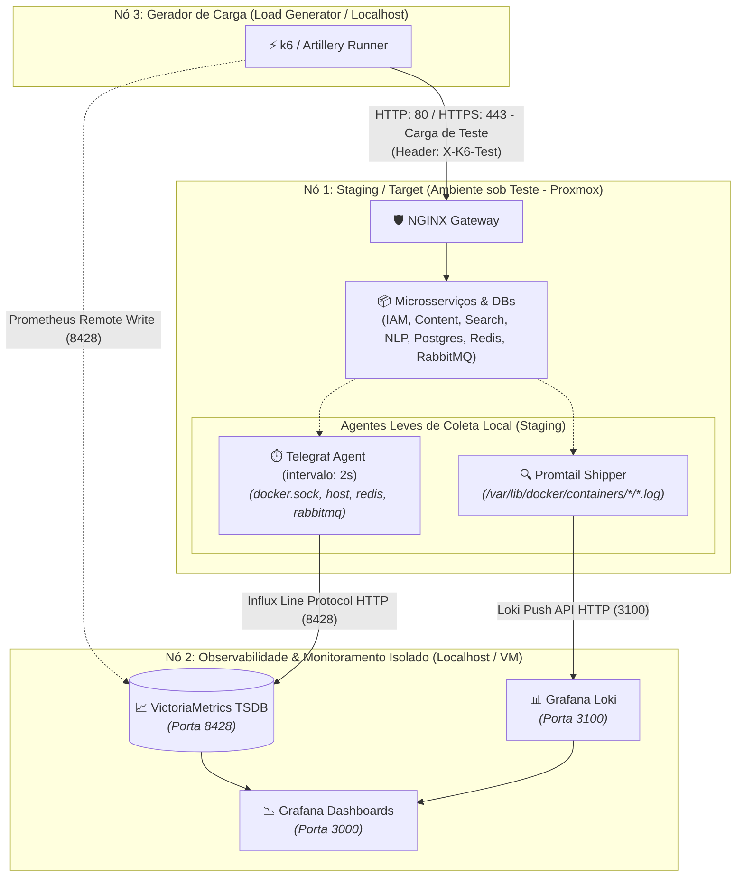

# 📚 Docs-Wiki: Plataforma de Conteúdo, NLP e Busca Híbrida

Plataforma completa de gestão de conhecimento técnico, documentação imutável com controle de versão **Git-like**, processamento de **NLP em lote com Parent-Document Retriever**, **Busca Híbrida Ponderada** e assistente **RAG contextual aterrado (Grounding)** alimentado pela **Gemini API**.

---

## 🏛️ 1. Diagrama de Arquitetura e Topologia de Observabilidade



---

## 🚀 2. Guia de Instalação e Execução no Homelab Proxmox

### Pré-requisitos
- **Linux (Ubuntu Server / Debian)** ou VM no Proxmox VE.
- **Docker Engine (v24+)** e **Docker Compose (v2.20+)**.
- **Node.js v20+** e **NPM v10+** (para desenvolvimento local).

### Passo a Passo de Instalação

1. **Clonar o Repositório e Navegar para a Pasta:**
   ```bash
   git clone <URL_DO_REPOSITORIO>
   cd docs-wiki
   ```

2. **Configurar as Variáveis de Ambiente:**
   No arquivo `.env` preencha sua chave de API do Gemini, e outras variáveis conforme sua necessidade:
   > ⚠️ **Importante:** Preencha a variável `GEMINI_API_KEY` no arquivo `.env`.

3. **Gerar Certificados SSL Locais (caso ainda não possua):**
   ```bash
   mkdir -p certs
   openssl req -x509 -nodes -days 365 -newkey rsa:2048 \
     -keyout certs/privkey.pem \
     -out certs/fullchain.pem \
     -subj "/CN=docswiki.local"
   ```

4. **Subir Todos os Containers via Docker Compose:**
   ```bash
   docker compose build --parallel
   docker compose up -d
   ```

5. **Acessar as Aplicações:**
   - **Interface Web:** [https://localhost](https://localhost) (ou `https://<IP_DO_PROXMOX>`)
   - **Documentação OpenAPI / Swagger UI:** [https://localhost/api-docs](https://localhost/api-docs)
   - **Painel do RabbitMQ:** `http://localhost:15672` (User/Pass definidos no `.env`)
   - **Logs Grafana Loki:** `http://localhost:3100`

---

## 📖 3. Manual de Uso das Funcionalidades

### 🔐 Autenticação e Usuário Super Admin
- O banco de dados é inicializado automaticamente com um **Super Usuário Administrador**:
  - **E-mail:** `admin@docswiki.local`
  - **Senha:** `123456`
  - **Proteção:** O usuário possui a flag `is_system_protected = TRUE`, bloqueando qualquer exclusão ou desativação acidental na API.
- A autenticação trafega tokens JWT estritamente em **Cookies `HttpOnly`, `Secure` e `SameSite=Lax`**.

### 🔑 Como se Autenticar e Autorizar no Swagger UI (`/api-docs`)

O Swagger UI ([http://localhost/api-docs](http://localhost/api-docs)) utiliza o esquema de segurança `cookieAuth` (Cookie HttpOnly `token`). Como o cookie é gerenciado nativamente pelo navegador, você pode se autorizar de três formas:

#### Método 1: Diretamente pelo Swagger UI (Recomendado)
1. Acesse [http://localhost/api-docs](http://localhost/api-docs).
2. Na seção **`IAM & Autenticação`**, expanda o endpoint `POST /api/v1/auth/login`.
3. Clique em **"Try it out"**.
4. No campo do JSON de entrada, insira as credenciais do administrador:
   ```json
   {
     "email": "admin@docswiki.local",
     "password": "123456"
   }
   ```
5. Clique em **"Execute"**.
6. A resposta retornará status `200 OK` e o navegador salvará automaticamente o cookie `token` de sessão.
7. **Pronto!** Todas as rotas protegidas (com o ícone de cadeado 🔒, como `POST /api/v1/content/materials`, `GET /api/v1/auth/me`, `POST /chat`, etc.) passarão a funcionar automaticamente nos próximos "Execute".

#### Método 2: Via Login na Interface Web
1. Acesse o frontend em [http://localhost/login](http://localhost/login) (ou `https://localhost/login`).
2. Realize o login com `admin@docswiki.local` e `123456`.
3. Abra a aba [http://localhost/api-docs](http://localhost/api-docs) no mesmo navegador.
4. Sua sessão já estará autenticada automaticamente para todos os endpoints.

#### Método 3: Via Botão "Authorize 🔓" no Topo da Página
1. Clique no botão verde **"Authorize"** no canto superior direito do Swagger UI.
2. No campo **`cookieAuth (apiKey in cookie)`**, cole o valor do token JWT.
3. Clique em **Authorize** e feche o modal.

> 💡 **Dica de Validação:** Para confirmar que a autorização foi concluída com sucesso, execute o endpoint `GET /api/v1/auth/me`. Ele deve retornar `200 OK` com seus dados e roles (`["ADMIN", "EDITOR", "LEITOR"]`).

### 📝 Formato OKF (Open Knowledge Formatting)
Todos os documentos cadastrados devem seguir o padrão estrito com **YAML Frontmatter + Markdown Body**:
```markdown
---
title: "Guia de Arquitetura de Software"
slug: "guia-arquitetura-software"
type: "artigo"
category: "engenharia"
tags: ["node", "postgres", "arquitetura"]
author: "Nome do Autor"
author_id: "00000000-0000-0000-0000-000000000001"
data_publicacao: "2026-08-08T00:00:00.000Z"
---
# Introdução aos Padrões Arquiteturais
Conteúdo detalhado do documento formatado em Markdown...
```

### 🌿 Controle de Versão Git-Like, Rollback e Diffs
- **Imutabilidade:** Toda edição gera uma nova versão com hash SHA-256 determinístico.
- **Concorrência Otimista:** Edições exigem o `parent_version_id` correto para prevenir conflitos de sobrescrita.
- **Rollback Seguro:** Restaura versões anteriores criando um novo commit histórico sem destruir registros passados.
- **Visualizador de Diffs:** Endpoint `GET /api/v1/content/materials/:id/diff?v1=1&v2=2` retorna alterações estruturadas linha por linha (`added`, `removed`, `unchanged`).

### 🔍 Busca Híbrida Ponderada e Sumarização por IA
- **Fórmula de Relevância Híbrida:**
  $$\text{Score Final} = 0.3 \times \text{BM25 (tsvector)} + 0.7 \times \text{VectorScore (pgvector cosine)}$$
- **Filtros Avançados:** Busca por autor, categoria, tipo, tags, período e busca fuzzy (distância Levenshtein via `pg_trgm`).
- **Sumarização Automática:** Adicionar `?summarize=true` na query dispara uma síntese direta da dúvida do usuário gerada pela Gemini API.

### 💬 Chat RAG com Documentos Selecionados
- A rota `POST /api/v1/search/chat` permite selecionar uma lista de `material_ids` e fazer perguntas técnicas. A Gemini API formula respostas aterradas exclusivamente nos trechos dos documentos selecionados com citações de fonte.

---

## 🧪 4. Guia de Testes Automatizados

O monorepo possui uma suíte completa de testes unitários e de integração em TypeScript com **Jest, Supertest e React Testing Library**.

### Executar Todos os Testes do Monorepo:
```bash
npm run test
```

### Comandos Individuais por Serviço:
```bash
# Testes de IAM e Autenticação (38 testes)
npm run test:iam

# Testes de Gestão de Conteúdo e Git-like (23 testes)
npm run test:content

# Testes do Worker de NLP e Chunking (12 testes)
npm run test:nlp

# Testes de Busca Híbrida, OpenAPI e RAG (15 testes)
npm run test:search

# Testes de Componentes Frontend com RTL (9 testes)
npm run test:frontend
```

---

## 📊 5. Observabilidade Distribuída & Monitoramento para Testes de Carga

A infraestrutura foi desenhada para suportar **testes de carga contínuos de alta fidelidade**, eliminando o "efeito observador" (evitando que a ingestão pesada de métricas e logs dispute CPU, memória e I/O com os serviços sob teste).

### 📐 Topologia de Comunicação e Portas



### 🚀 Como Executar os Ambientes

#### 1. Iniciar o Nó de Monitoramento (Máquina Isolada de Observabilidade):
Na máquina dedicada ao monitoramento:
```bash
docker compose -f docker-compose.monitoring.yml up -d
```
- **VictoriaMetrics (Métricas):** `http://<IP_MONITORING>:8428`
- **Grafana Loki (Logs):** `http://<IP_MONITORING>:3100`
- **Grafana (Painéis):** `http://<IP_MONITORING>:3000` (Usuário: `admin` / Senha: `admin123` pré-configurado com datasources automáticos)

#### 2. Iniciar o Nó de Staging (Ambiente sob Teste):
Na máquina do ambiente de staging, configure no arquivo `.env`:
```env
VICTORIAMETRICS_HOST=<IP_MONITORING>
LOKI_HOST=<IP_MONITORING>
```
E suba a aplicação com os coletores locais:
```bash
docker compose up -d
```

- **Telegraf:** Coleta métricas a cada `2s` do Docker, Host, Redis e RabbitMQ e despacha via rede para o VictoriaMetrics.
- **Promtail:** Coleta logs dos containers em rotação de 15MB e envia via rede para o Loki.

---

## ⚡ 6. Testes de Carga & Performance (Grafana k6)

O projeto inclui suítes completas de testes de carga simulando jornadas reais com política de **Zero Custo de Tokens de IA** (`GEMINI_API_KEY=mock_gemini_api_key`), bypass seguro de rate limit de borda via cabeçalho `X-K6-Secret` (Padrão B: Shared Secret) e geração de relatórios executivos com gráficos interativos.

```powershell
# 1. Smoke Test (5 VUs - 1 min) - Validação rápida de rotas
docker compose -f docker-compose.k6.yml run --rm -e SCENARIO=smoke k6

# 2. Load Test (25 VUs - 10 min) - Carga operacional típica
docker compose -f docker-compose.k6.yml run --rm -e SCENARIO=load k6

# 3. Stress Test (Pico em 80 VUs - 6 min) - Teste de saturação e resiliência
docker compose -f docker-compose.k6.yml run --rm -e SCENARIO=stress k6

# 4. Soak Test (15 VUs - 30 min) - Estabilidade contínua
docker compose -f docker-compose.k6.yml run --rm -e SCENARIO=soak k6
```

- **Relatórios HTML Executivos:** Gerados em `./k6/reports/k6-summary-<cenario>.html` com 6 gráficos temporais, favicon exclusivo e tabela com diagnóstico recolhível de erros HTTP.
- **Painel em Tempo Real no Grafana (Nó Gerador de Carga / Localhost):** Acesse [http://localhost:3000/d/k6-load-testing](http://localhost:3000/d/k6-load-testing) (Usuário: `admin` / Senha: `admin123`).

---

## 🛠️ 7. Resolução de Problemas (Troubleshooting)

| Sintoma | Causa Provável | Solução |
| :--- | :--- | :--- |
| **Erro de conexão com o Postgres** | Containers iniciados antes do banco estar pronto. | O `docker-compose.yml` utiliza `depends_on: condition: service_healthy`. Verifique os logs com `docker compose logs postgres`. |
| **Erro 401 Unauthorized no Chat ou Busca** | Cookie de autenticação ausente ou expirado. | Faça login novamente em `/login` para emitir um novo token JWT no cookie. |
| **Erro 429 Too Many Requests no Teste k6** | Nginx de Staging com rate limit antigo em memória ou `X-K6-Secret` incorreto. | Execute no servidor: `git pull origin staging` e recarregue com `docker exec homelab_nginx nginx -s reload`. |
| **Erro de Certificado SSL no Nginx (`cannot load certificate`)** | Arquivos `fullchain.pem` ou `privkey.pem` ausentes em `certs/`. | Gere os certificados com: `sudo openssl req -x509 -nodes -days 365 -newkey rsa:2048 -keyout certs/privkey.pem -out certs/fullchain.pem -subj "/CN=192.168.0.107"` e reinicie com `docker restart homelab_nginx`. |
| **Sumarização / Chat RAG não responde** | `GEMINI_API_KEY` ausente ou inválida. | Verifique se a chave da API do Gemini está configurada no `.env` e reinicie o serviço com `docker compose restart search-service`. |
| **Erro de Certificado SSL no Navegador** | Certificado autoassinado gerado para desenvolvimento. | Aceite o certificado no navegador ou configure certificados válidos via Let's Encrypt / Certbot em `certs/`. |

---

## 📄 Licença
Distribuído sob a licença **MIT**. Consulte `LICENSE` para obter mais informações.
