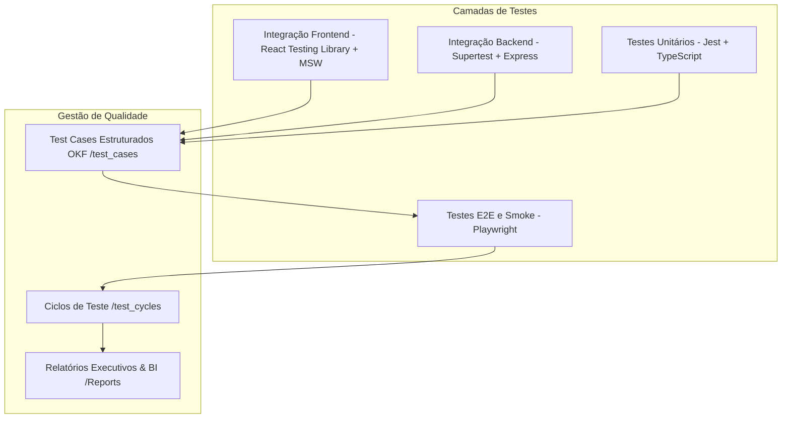
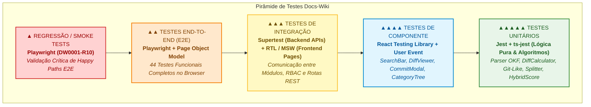

# Estratégia e Arquitetura de Testes — Monorepo Docs-Wiki

Este documento apresenta a especificação técnica e arquitetura de testes automatizados do ecossistema **Docs-Wiki**. Ele serve como guia para engenheiros de software, engenheiros de QA e engenheiros de DevOps para entender a cobertura, pirâmide de testes, políticas de mock, ciclos de teste (Test Cycles), suítes End-to-End (Playwright), relatórios executivos de BI e execução em pipelines de CI/CD.

---

## 1. Visão Geral da Arquitetura de Testes

Adotamos uma abordagem baseada em **Testes Herméticos, Determinísticos e em Camadas** por componente de microsserviço no monorepo. Para garantir alta velocidade nas esteiras de integração contínua (CI/CD) e eliminar testes intermitentes (*flaky tests*), cada camada executa suas próprias suítes em sandbox usando mocks bem definidos nas fronteiras de infraestrutura (PostgreSQL/pgvector, RabbitMQ, Redis e APIs de IA externas do Google Gemini).



### Tecnologias Globais de Teste
* **Test Runner / Assertions (Unitário & Integração)**: [Jest](https://jestjs.io/) e `ts-jest` para execução nativa de TypeScript.
* **Testes de API / Rotas**: [Supertest](https://github.com/ladjs/supertest) para simulação de requisições HTTP sem necessidade de bind em portas de rede reais.
* **Componentes Frontend**: [React Testing Library](https://testing-library.com/docs/react-testing-library/intro/) (RTL) para assertions centradas no comportamento do usuário final, e `@testing-library/user-event` para simulação realista de eventos do browser.
* **Testes de Ponta a Ponta (E2E) & Smoke**: [Playwright Test](https://playwright.dev/) com arquitetura baseada em **Page Object Model (POM)** e interceptação determinística de rede via `page.route`.

### 1.1. Análise da Pirâmide de Testes

A distribuição das suítes de teste no monorepo **QAndora Docs-Wiki** segue rigorosamente o princípio da **Pirâmide de Testes**, garantindo alta velocidade de feedback na base (testes unitários e componentes), isolamento robusto no meio (integração de APIs e rotas) e validação de confiança máxima no topo (fluxos E2E e testes de regressão smoke).



#### Tabela Comparativa das Camadas da Pirâmide

| Nível da Pirâmide | Tipo de Teste | Frameworks & Tecnologias | Escopo & Isolamento | Volume / Proporção | Tempo Médio | Propósito & Exemplos no Monorepo |
| :--- | :--- | :--- | :--- | :---: | :---: | :--- |
| **Topo** | **Regressão / Smoke** | Playwright Test | Ponta a ponta hermético, validação crítica de integridade dos *happy paths*. | Compacto (13 testes no ciclo DW0001-R10) | ~35s total | Garantir que nenhum fluxo essencial do sistema quebrou após novos deploys ou merges. Valida login, criação OKF, rollback, busca híbrida e RBAC. |
| **Superior** | **End-to-End (E2E)** | Playwright (Chromium/Webkit) + POM | Interface completa no browser com interceptação de rede determinística (`page.route`). | Alto (8 suítes ativas, 44 testes funcionais) | ~2.2 min total | Simular a experiência real do usuário interagindo com elementos visuais, formulários, modais, diffs e chat RAG em Staging. |
| **Intermediário** | **Integração** | Jest + Supertest (Backend) / RTL + MemoryRouter (Frontend) | Integração entre controllers, middleware RBAC, DTOs Zod e clientes de API. | Médio-Alto (Rotas de IAM, Content, NLP e Search) | ~1-2s por suíte | Validar contratos de API HTTP (status codes, headers, validação DTO, cookies JWT) e integração de páginas completas com React Query. |
| **Intermediário-Base** | **Componente** | React Testing Library + `@testing-library/user-event` | Componentes visuais isolados com simulação de interações do usuário. | Médio (Componentes do Frontend) | ~500ms por suíte | Garantir que componentes isolados (`SearchBar`, `DiffViewer`, `CommitModal`, `AdvancedFilters`) reajam corretamente a cliques, digitação e estados de erro. |
| **Base** | **Unitário** | Jest + `ts-jest` | Funções puras, parsers, regras de negócio e algoritmos de cálculo matemático. | Base massiva (Mais de 25 suítes unitárias) | < 100ms por teste | Testar de forma ultra veloz módulos críticos como `okfParser` (YAML/Markdown), `diffCalculator` (linha por linha), `gitLikeService` (SHA-256/OCC) e `hybridScore` (RRF). |

---

## 2. Estrutura de Gestão de Casos e Ciclos de Teste (`test-cases/`)

O repositório adota o padrão **Open Knowledge Format (OKF)** para gerenciar todo o ciclo de vida de QA em arquivos Markdown estruturados com metadados YAML.

```
test-cases/
├── test_cases/          # Especificação atômica dos 37 casos de teste
│   ├── IAM/             # Autenticação, Registro, RBAC, Segurança, Exclusão
│   ├── Conteudo/        # Padrão OKF, Versões Git-Like, Rollback, OCC, Exclusão
│   ├── NLP/             # Chunking, Embeddings, Cache Redis, Expurgo, RabbitMQ
│   ├── Busca/           # Busca Híbrida (FTS + Vector), Catálogo, Rate Limit
│   ├── Chat/            # Assistente RAG, Grounding Gemini, Validação
│   ├── DevOps/          # Pipelines CI/CD, Tag LTS, Rollback Automático
│   └── Performance/     # Testes de Carga k6, Observabilidade, SLAs
├── test_cycles/         # 10 Ciclos de Testes (DW0001-R1 a DW0001-R10)
├── automated-tests/     # Automação E2E Playwright (Page Objects, Helpers, Specs)
└── Reports/             # Relatórios Executivos Markdown e Planilha Excel BI
```

### 2.1. Casos de Teste (`test-cases/test_cases/`)
São **37 casos de teste únicos** categorizados por domínios funcionais e técnicos:

| Domínio | Chaves | Descrição / Foco |
| :--- | :--- | :--- |
| **IAM** | `DW-T1` a `DW-T8`<br>`DW-T26` a `DW-T30` | Cadastro, duplicidade de e-mail, login JWT, validação Zod DTO, rate limiting, gestão de papéis RBAC, bloqueio 403, auto-exclusão e cascata. |
| **Conteúdo** | `DW-T9` a `DW-T15`<br>`DW-T31` a `DW-T32` | Criação OKF, versionamento imutável (commits), rollback seguro, validação YAML/frontmatter, concorrência OCC e exclusão de materiais. |
| **NLP** | `DW-T16` a `DW-T19`<br>`DW-T33` | Chunking semântico de Markdown, embeddings de 768d, cache Redis, mensageria RabbitMQ e expurgo vetorial assíncrono. |
| **Busca** | `DW-T20` a `DW-T23` | Busca híbrida ponderada (FTS BM25 + HNSW), síntese executiva via Gemini, modo catálogo paginado e rate limit. |
| **Chat** | `DW-T24` a `DW-T25` | Chat RAG contextual com múltiplos materiais, grounding estrito no Gemini, badges de citação e alertas de seleção obrigatória. |
| **DevOps** | `DW-T34` a `DW-T35` | Esteira automatizada no GitHub Actions, execução de suítes de testes, tag LTS e rollback automático em falha. |
| **Performance** | `DW-T36` a `DW-T37` | Carga sintética k6, telemetria Telegraf/VictoriaMetrics, logs Loki, dashboards Grafana e validação de SLAs de latência. |

### 2.2. Ciclos de Testes (`test-cases/test_cycles/`)
Os casos de teste são organizados em **10 ciclos de homologação e regressão**:

1. **[DW0001-R1](test-cases/test_cycles/DW0001-R1.md) — Login, Registro e Permissões IAM**: 8 testes funcionais cobrindo auto-registro, conflito de e-mail, autenticação JWT, bloqueio RBAC e rate limiting.
2. **[DW0001-R2](test-cases/test_cycles/DW0001-R2.md) — Criação, Versionamento Git-Like e Rollback**: 7 testes validando criação OKF, novas versões com HEAD incremental, rollback não-destrutivo, slug duplicado e OCC.
3. **[DW0001-R3](test-cases/test_cycles/DW0001-R3.md) — Pipeline Assíncrono NLP, Chunking e Embeddings**: 4 testes cobrindo chunking semântico, geração de embeddings locais, cache Redis e NACK RabbitMQ.
4. **[DW0001-R4](test-cases/test_cycles/DW0001-R4.md) — Busca Híbrida Ponderada e Sumarização IA**: 4 testes validando busca combinada FTS+Vector, sumarização Gemini, modo catálogo e rate limiting.
5. **[DW0001-R5](test-cases/test_cycles/DW0001-R5.md) — Chat RAG Contextual e Grounding Gemini**: 2 testes cobrindo chat contextual multí-documento com badges de citação e alerta de seleção.
6. **[DW0001-R6](test-cases/test_cycles/DW0001-R6.md) — Gestão Administrativa de Usuários e RBAC**: 5 testes cobrindo edição de permissões transacionais, HTTP 403, exclusão em cascata e salvaguarda do perfil LEITOR.
7. **[DW0001-R7](test-cases/test_cycles/DW0001-R7.md) — Exclusão em Cascata e Expurgo de Materiais**: 3 testes validando deleção de material, modal de confirmação, emissão de eventos RabbitMQ e expurgo vetorial.
8. **[DW0001-R8](test-cases/test_cycles/DW0001-R8.md) — Pipeline CI/CD, LTS e Rollback Automático**: 2 testes de esteira automatizada no GitHub Actions e recuperação por rollback.
9. **[DW0001-R9](test-cases/test_cycles/DW0001-R9.md) — Testes de Carga e Observabilidade**: 2 testes não-funcionais cobrindo carga sintética k6, telemetria e análise de saturação.
10. **[DW0001-R10](test-cases/test_cycles/DW0001-R10.md) — Regressão Smoke (Teste de Fumaça) E2E**: 13 testes contendo os caminhos principais (*happy paths*) de ponta a ponta da plataforma Docs-Wiki.

---

## 3. Relatórios Executivos de BI (`test-cases/Reports/`)

A pasta [test-cases/Reports/](test-cases/Reports) reúne todos os relatórios executivos gerados para acompanhamento de qualidade, auditoria e homologação:

* **Relatórios Individuais por Ciclo (`DW0001-R1.md` a `DW0001-R10.md`)**: Contêm informações detalhadas de duração, taxa de execução, aprovação e uma tabela discriminando o resultado (`Pass` / `Not Executed` / `Fail`) de cada caso de teste no ambiente de Staging.
* **Relatório Agregado da Pasta ([test_cycles.md](test-cases/Reports/test_cycles.md))**: Consolidação executiva de todos os ciclos analisados:
  * **Total de Casos em Ciclos**: `50`
  * **Total de Casos de Teste Únicos**: `37`
  * **Testes Executados**: `46` (**92.0%**)
  * **Taxa de Aprovação (Pass Rate)**: **100.0%**
  * **Defeitos / Falhas**: `0`
* **Planilha Executiva Excel ([test_cycles.xlsx](test-cases/Reports/test_cycles.xlsx))**:
  * **Execuções Detalhadas**: Tabela com todas as últimas execuções registradas com Chave, Título, Status, Ambiente, Versão, Responsável e Data.

---

## 4. Testes de Integração & Regressão E2E com Playwright

A suíte E2E automatizada reside em [test-cases/automated-tests/](test-cases/automated-tests) e foi projetada para validar fluxos completos de ponta a ponta no navegador (Chromium/Chrome) apontando para o ambiente de Staging.

### 4.1. Arquitetura Page Object Model (POM)
Os componentes de tela e interações com a UI são isolados em classes especializadas sob `page-objects/`:
* [LoginPage.ts](test-cases/automated-tests/page-objects/LoginPage.ts): Preenchimento de credenciais, validação de erros de autenticação e redirecionamento.
* [RegisterPage.ts](test-cases/automated-tests/page-objects/RegisterPage.ts): Validação de campos de auto-cadastro e mensagens de feedback.
* [HomePage.ts](test-cases/automated-tests/page-objects/HomePage.ts): Catálogo de documentos, pesquisa com debounce, filtros de categoria e cards de síntese executiva.
* [EditorPage.ts](test-cases/automated-tests/page-objects/EditorPage.ts): Editor de Markdown/YAML OKF, preview lado a lado, modal de commit e rollback.
* [DiffPage.ts](test-cases/automated-tests/page-objects/DiffPage.ts): Visualização comparativa de revisões e histórico de versões.
* [ChatPage.ts](test-cases/automated-tests/page-objects/ChatPage.ts): Painel de chat RAG, seletor de materiais de contexto, streaming de respostas e badges de citação.
* [UsersManagementPage.ts](test-cases/automated-tests/page-objects/UsersManagementPage.ts): Tabela administrativa de usuários, controle transacional de checkboxes de papéis RBAC e modais de exclusão.
* [NavbarComponent.ts](test-cases/automated-tests/page-objects/NavbarComponent.ts): Navegação global, perfil autenticado e botão de logout.

### 4.2. Suítes Automatizadas Implementadas
São **8 suítes funcionais ativas** cobrindo **44 testes automatizados**:

| Suíte Playwright | Ciclo Correspondente | Qtd. Testes | Resultado |
| :--- | :--- | :---: | :---: |
| [DW0001-R1.spec.ts](test-cases/automated-tests/tests/DW0001-R1.spec.ts) | DW0001-R1 (IAM & Autenticação) | 8 | 8 passed (100%) |
| [DW0001-R2.spec.ts](test-cases/automated-tests/tests/DW0001-R2.spec.ts) | DW0001-R2 (Conteúdo & Git-Like) | 7 | 7 passed (100%) |
| [DW0001-R3.spec.ts](test-cases/automated-tests/tests/DW0001-R3.spec.ts) | DW0001-R3 (Pipeline NLP & Embeddings) | 4 | 4 passed (100%) |
| [DW0001-R4.spec.ts](test-cases/automated-tests/tests/DW0001-R4.spec.ts) | DW0001-R4 (Busca Híbrida & IA) | 4 | 4 passed (100%) |
| [DW0001-R5.spec.ts](test-cases/automated-tests/tests/DW0001-R5.spec.ts) | DW0001-R5 (Chat RAG & Grounding) | 2 | 2 passed (100%) |
| [DW0001-R6.spec.ts](test-cases/automated-tests/tests/DW0001-R6.spec.ts) | DW0001-R6 (Gestão RBAC & Usuários) | 5 | 5 passed (100%) |
| [DW0001-R7.spec.ts](test-cases/automated-tests/tests/DW0001-R7.spec.ts) | DW0001-R7 (Exclusão & Expurgo) | 3 | 3 passed (100%) |
| [DW0001-R10.spec.ts](test-cases/automated-tests/tests/DW0001-R10.spec.ts) | DW0001-R10 (Regressão Smoke E2E) | 11 | 11 passed (100%) |
| **TOTAL** | **8 Suítes Funcionais** | **44** | **44 passed (100%)** |

### 4.3. Análise da Suíte de Regressão Smoke (`DW0001-R10.spec.ts`)
A suíte de teste de fumaça executa a validação crítica dos fluxos essenciais (*happy paths*) da aplicação em sequência:
1. **DW-T3**: Login administrativo e validação de token em rota protegida.
2. **DW-T4**: Auto-registro de novo usuário e redirecionamento para login.
3. **DW-T9**: Rollback seguro de versão restaurando snapshot histórico.
4. **DW-T11**: Criação de material no padrão OKF com YAML Frontmatter.
5. **DW-T12**: Publicação de nova versão incremental com cálculo de diff.
6. **DW-T18**: Geração e indexação de embeddings locais com cache Redis.
7. **DW-T20**: Busca híbrida ponderada com síntese executiva gerada por IA.
8. **DW-T24**: Chat RAG com múltiplos documentos selecionados e citações de fontes.
9. **DW-T26**: Atualização transacional de papéis RBAC no painel administrativo.
10. **DW-T28**: Exclusão de usuário com modal de confirmação.
11. **DW-T31**: Exclusão de material por administrador e disparo de eventos de expurgo.

---

## 5. Suítes de Testes Unitários e de Integração (Jest)

### 5.1. Frontend (`frontend/src/tests`)
* **Tecnologias**: Jest, React Testing Library e MSW.
* **Estratégia**: Mocks de chamadas HTTP via `apiClient`, testes de hooks React Query e validação de estados de carregamento e formulários.
* **Suítes**: `auth.test.tsx`, `catalog.test.tsx`, `diff.test.tsx`, `editor.test.tsx`, `rag.test.tsx`.

### 5.2. Serviços Backend (`services/`)
* **Serviço de IAM (`services/iam/tests/`)**:
  * Unitários: `auth.service.spec.ts`, `user.service.spec.ts`, `token.service.spec.ts`, `password.service.spec.ts`, `dto.validation.spec.ts`.
  * Integração: `auth.routes.spec.ts`, `user.routes.spec.ts` (validação de endpoints e RBAC).
* **Serviço de Conteúdo (`services/content/tests/`)**:
  * Unitários: `okfParser.test.ts` (parser de frontmatter/markdown), `diffCalculator.test.ts` (cálculo de diff linha por linha), `gitLike.service.test.ts` (commits, SHA-256 e detecção OCC).
  * Integração: `material.routes.test.ts` (rotas REST de materiais).
* **Serviço de NLP (`services/nlp/tests/`)**:
  * Unitários: `markdown-splitter.test.ts` (chunking semântico), `embedder.test.ts` (vetores 768d), `nlp.service.test.ts` (orquestração).
  * Integração: `nlp.consumer.test.ts` (consumo de eventos RabbitMQ).
* **Serviço de Busca (`services/search/tests/`)**:
  * Unitários: `hybrid-score.test.ts` (algoritmo de fusão ponderada), `search.service.test.ts`, `rag-chat.service.test.ts` (Grounding Gemini).
  * Integração: `search.integration.test.ts` (rotas `/search`, `/search/chat`, `/health`), `swagger.test.ts` (OpenAPI).

---

## 6. Integração Contínua (CI/CD) & Melhores Práticas

### 6.1. Como Rodar os Testes Automatizados

#### A. A Partir da Raiz do Monorepo (Atalhos NPM):
```powershell
# Executar todos os testes de backend e frontend (Jest)
npm run test

# Executar apenas testes do frontend
npm run test:frontend

# Executar apenas testes de backend
npm run test:backend

# Executar testes de um microsserviço específico
npm run test:iam
npm run test:content
npm run test:nlp
npm run test:search

# Executar a suíte completa de testes E2E Playwright (Headless)
npm run test:e2e

# Executar a suíte E2E Playwright com navegador visível (Headed)
npm run test:e2e:headed
```

#### B. Diretamente na Pasta de Testes Automatizados (`test-cases/automated-tests`):
```powershell
cd test-cases\automated-tests

# Rodar todos os 44 testes E2E em modo headless
npx playwright test --reporter=line

# Rodar todos os testes com interface gráfica visível
npx playwright test --headed --reporter=line

# Rodar apenas uma suíte específica (ex: Smoke Test DW0001-R10)
npx playwright test tests/DW0001-R10.spec.ts --headed --reporter=line

# Rodar testes com a UI interativa do Playwright
npx playwright test --ui

# Visualizar o relatório HTML detalhado do Playwright
npx playwright show-report
```

---

### 6.2. Melhores Práticas para os Testes Automatizados

1. **Isolamento Hermético e Determinismo de Rede**:
   * Em testes E2E com Playwright, utilize sempre o helper [mock-routes.ts](test-cases/automated-tests/helpers/mock-routes.ts) (`setupMockRoutes(page)`). As rotas de backend e de IA são interceptadas via `page.route`, eliminando dependências de rede externa instáveis ou serviços terceiros.
2. **Page Object Model (POM) Estrito**:
   * Toda interação com elementos visuais da interface (cliques, digitação, seleção de opções, asserções de visibilidade) deve ser encapsulada nos métodos dos Page Objects (`LoginPage`, `EditorPage`, etc.). Nunca acesse seletores CSS ou XPaths diretamente nos arquivos `.spec.ts`.
3. **Seletores Semânticos e Resilientes (`data-testid`)**:
   * Dê preferência absoluta ao uso de atributos `data-testid` (ex: `page.locator('[data-testid="input-busca"]')`) ou localizadores de acessibilidade (`getByRole`, `getByLabel`). Isso torna os testes imunes a alterações estéticas de classes CSS ou Tailwind.
4. **Tratamento de Estado em Formulários Controlados do React**:
   * Para checkboxes e campos controlados em React/TanStack Form, utilize o método `.click()` no elemento para assegurar o disparo limpo dos eventos `onChange` e mutações do React Query.
5. **Execução Linear Sequencial em Integração Backend**:
   * Nos testes Jest de backend que utilizam mocks globais ou conexões simuladas, execute sempre com `--runInBand` para evitar condições de corrida entre suítes concorrentes.
6. **Mocks de LLMs e Modelos de IA**:
   * Nunca faça chamadas reais para as APIs do Google Gemini Studio durante a execução de suítes de testes automatizados ou em esteiras de CI/CD. Utilize sempre stubs de resposta predefinidos para garantir tempo de execução previsível (< 3s por suíte) e custo zero.
7. **Rastreabilidade Bidirecional (Traceability)**:
   * Cada arquivo de teste E2E (`DW0001-RX.spec.ts`) mapeia diretamente para seu ciclo (`DW0001-RX.md`) e para os casos de teste atômicos (`DW-TX.md`), garantindo que alterações no produto possam ser auditadas e refletidas imediatamente nos relatórios executivos de BI em [test-cases/Reports/](test-cases/Reports).
