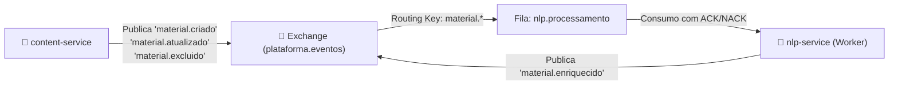

# BE-OVERVIEW-001: Visão Geral da Arquitetura Backend: Microsserviços Node.js

> **Resumo Executivo:** Apresenta os 4 microsserviços especializados de backend, seus contratos de comunicação, topologia de mensageria assíncrona e particionamento de banco de dados.

## 🎯 Visão Geral
O Backend do **Docs-Wiki** é arquitetado como uma constelação de microsserviços Node.js 20 LTS estritamente tipados com TypeScript 5.4.5, compartilhando tipos e contratos através do pacote monorepo `@shared/contracts`.

### Os 4 Microsserviços:
1. **`iam-service` (Porta 3001):** Autenticação JWT com cookies `HttpOnly`, hashing Bcrypt com 12 rounds de salt, rate limiters por IP e autorização baseada em papéis (RBAC).
2. **`content-service` (Porta 3002):** Versionamento imutável de materiais técnicos no padrão OKF, controle de concorrência otimista (OCC), cálculo de hashes determinísticos SHA-256 e emissão de eventos AMQP.
3. **`nlp-service` (Worker Daemon):** Processador em background que consome eventos do RabbitMQ, decompõe Markdown por cabeçalhos estruturados com overlap de 50 palavras, calcula embeddings de 768 dimensões com cache Redis e persiste vetores HNSW.
4. **`search-service` (Porta 3004):** Motor de busca de alta velocidade executando a fórmula ponderada ($0.3 \times \text{BM25} + 0.7 \times \text{Cosine Similarity}$) e assistente conversacional RAG com aterramento no modelo Google Gemini 2.0 Flash (temperatura 0.2).

---

## 📐 Detalhes Técnicos e Contratos

### Topologia de Eventos Assíncronos (RabbitMQ)



---

## 🧪 Estratégia de Teste e Validação
A suíte de testes de backend conta com 88 testes automatizados executados via:
```bash
npm run test:backend
```

---

## 🔗 Conexões no Grafo (Dependências)
* **Catálogo de Endpoints:** [Endpoints Compilados](./api/endpoints-compilados.md)
* **Serviços de Domínio:** [GitLikeService](./services/git-like-service.md), [NLPService](./services/nlp-service.md), [HybridSearchService](./services/hybrid-search-service.md), [RAGChatService](./services/rag-chat-service.md), [IAMAuthService](./services/iam-auth-service.md)
* **Modelos de Dados:** [Database Schemas](./models/database-schemas.md)
