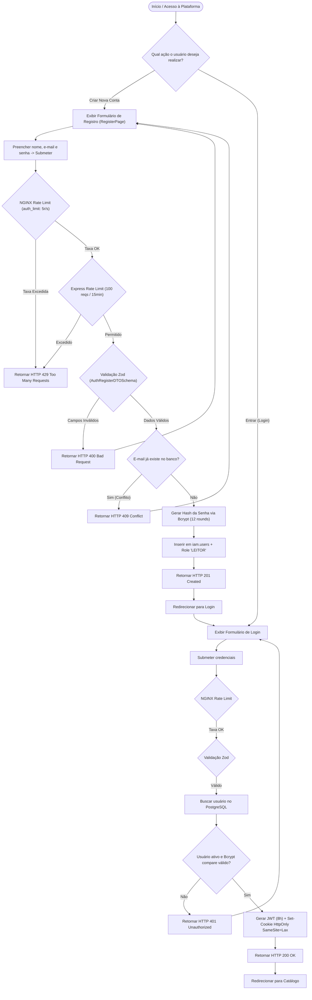
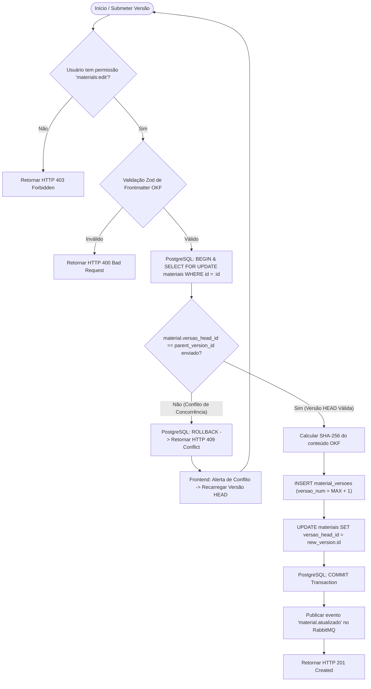
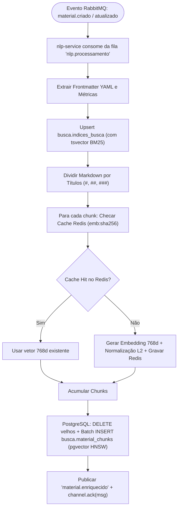
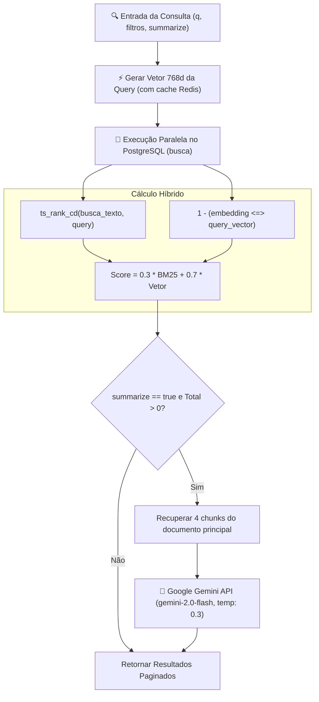
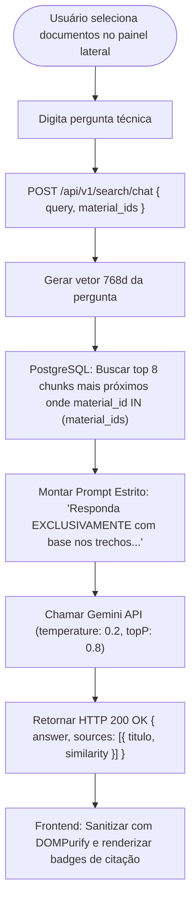
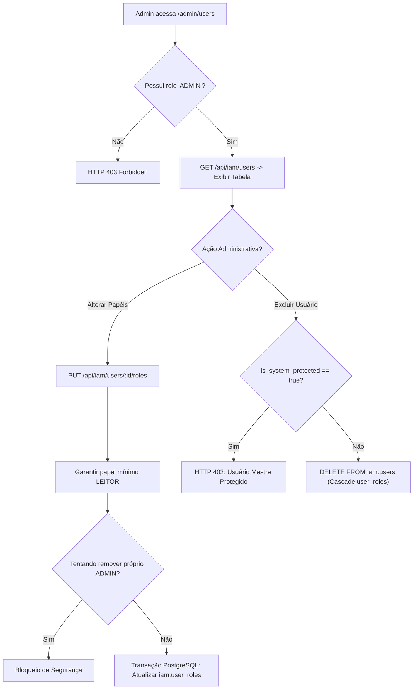
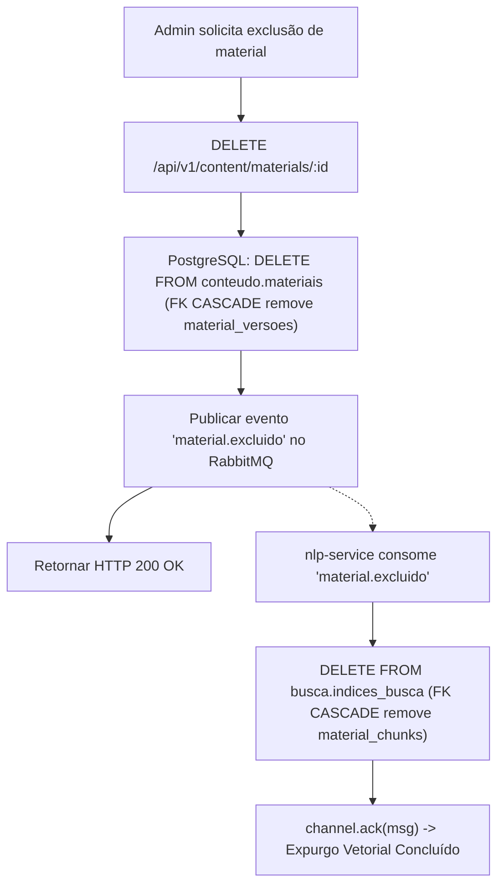
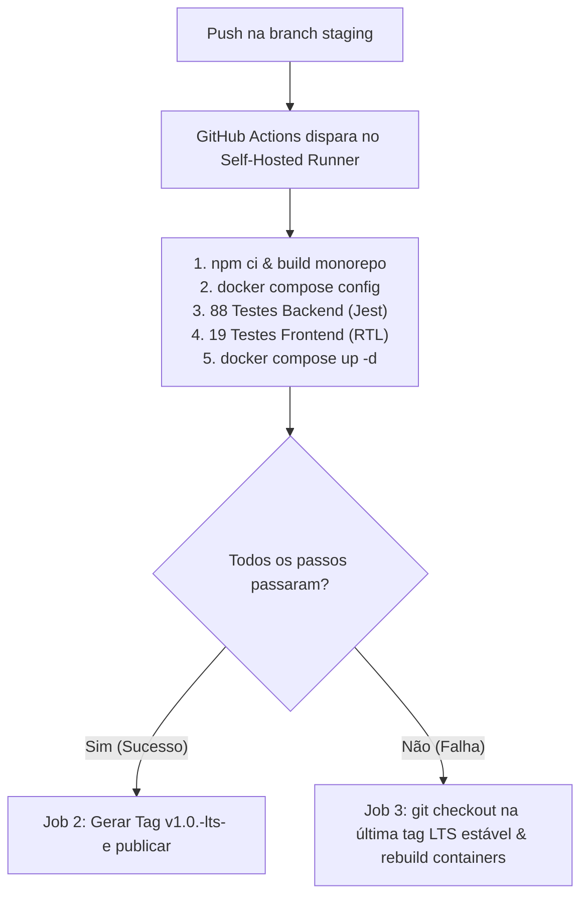
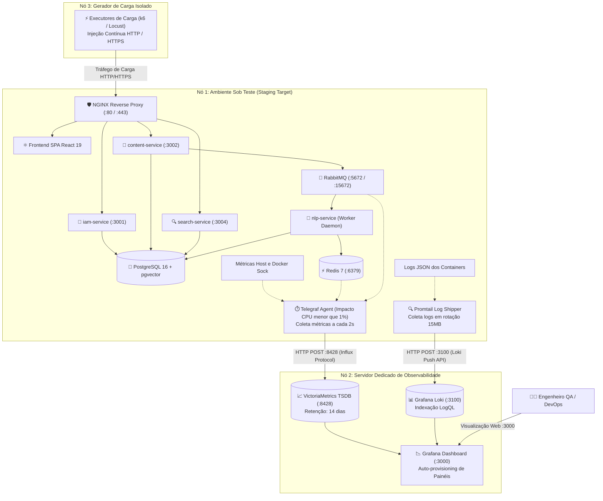

# DOM-FLOWS-003: Mapeamento Completo dos 9 Fluxos de Valor e Negócio

> **Resumo Executivo:** Documentação técnica exaustiva dos 9 fluxos de valor e negócio implementados na plataforma Docs-Wiki, cobrindo cenários felizes, branches de exceção, loops de recuperação e concorrência otimista.

## 🎯 Visão Geral
Este documento discorre e detalha a arquitetura de execução dos 9 fluxos operacionais que regem a plataforma Docs-Wiki, estabelecendo a rastreabilidade entre eventos de interface, regras de negócio de backend, transações de banco de dados e mensageria assíncrona.

---

## 📐 Detalhes Técnicos e Análise dos Fluxos

### 1. Fluxo 1: Autenticação, Registro, Sessão HttpOnly e RBAC
**Objetivo de Negócio:** Garantir o acesso seguro, mitigar ataques de força bruta com rate limiting duplo, validar e-mails únicos, emitir tokens JWT em cookies `HttpOnly` e proteger rotas administrativas.

---

### 2. Fluxo 2: Gestão de Conteúdo OKF, Versionamento Git-Like e Concorrência Otimista (OCC)
**Objetivo de Negócio:** Permitir a edição estruturada de documentos, detectar conflitos de edição simultânea sem perda de dados via `parent_version_id`, manter histórico criptográfico com SHA-256 e permitir rollbacks não-destrutivos.

---

### 3. Fluxo 3: Pipeline Assíncrono de Ingestão NLP, Chunking e Embeddings 768d
**Objetivo de Negócio:** Ingestão desacoplada orientada a eventos para que edições no editor não fiquem bloqueadas aguardando a geração vetorial; divisão estruturada por seções Markdown e cache Redis para evitar reprocessamento de embeddings idênticos.

---

### 4. Fluxo 4: Busca Híbrida Ponderada (BM25 + pgvector) e Sumarização por IA
**Objetivo de Negócio:** Prover recuperação de altíssima relevância combinando precisão léxica (BM25) com compreensão semântica (pgvector) e sumarização opcional sob demanda via Gemini 2.0 Flash.

---

### 5. Fluxo 5: Painel de Chat RAG Contextual Aterrado (Grounding Gemini)
**Objetivo de Negócio:** Permitir que desenvolvedores façam perguntas técnicas aprofundadas com respostas 100% ancoradas nos documentos selecionados, eliminando alucinações através de temperatura 0.2 e fornecendo citações transparentes de similaridade.

---

### 6. Fluxo 6: Gestão Administrativa de Usuários, Atribuição de Roles e Proteção de Super Admin
**Objetivo de Negócio:** Permitir a governança granular de acessos sem risco de auto-rebaixamento de administradores ou exclusão acidental da conta raiz do sistema (`is_system_protected`).

---

### 7. Fluxo 7: Exclusão em Cascata e Expurgos de Materiais do Acervo
**Objetivo de Negócio:** Garantir a remoção atômica e consistente de documentos, eliminando automaticamente todas as versões históricas, índices de busca e vetores no pgvector sem deixar registros órfãos.

---

### 8. Fluxo 8: Pipeline CI/CD, Releases LTS e Rollback Automático
**Objetivo de Negócio:** Automação de deploy contínuo em ambiente Homelab com execução hermética de testes e recuperação de desastres transparente via rollback de tags LTS.

---

### 9. Fluxo 9: Topologia de Observabilidade e Monitoramento sem Efeito Observador
**Objetivo de Negócio:** Isolar o processamento de telemetria para garantir que coletas em tempo real de métricas e logs não degradem a performance da aplicação durante testes de carga de alta intensidade.

---

## 🧪 Estratégia de Teste e Validação
Todos os diagramas possuem arquivos espelhados no formato Draw.io na pasta `diagrams/` para edição e documentação visual complementar.

---

## 📚 Citations
[1] [Mermaid Diagramming Documentation](https://mermaid.js.org/)  
[2] [Enterprise Integration Patterns (Gregor Hohpe)](https://www.enterpriseintegrationpatterns.com/)  

---

## 🔗 Conexões no Grafo (Dependências)
* **Visão Geral:** [Visão do Domínio](./overview.md)
* **Regras de Negócio:** [Regras de Domínio](./regras-de-negocio.md)
* **Diagramas Draw.io:** [`diagrams/`](../../diagrams/)
