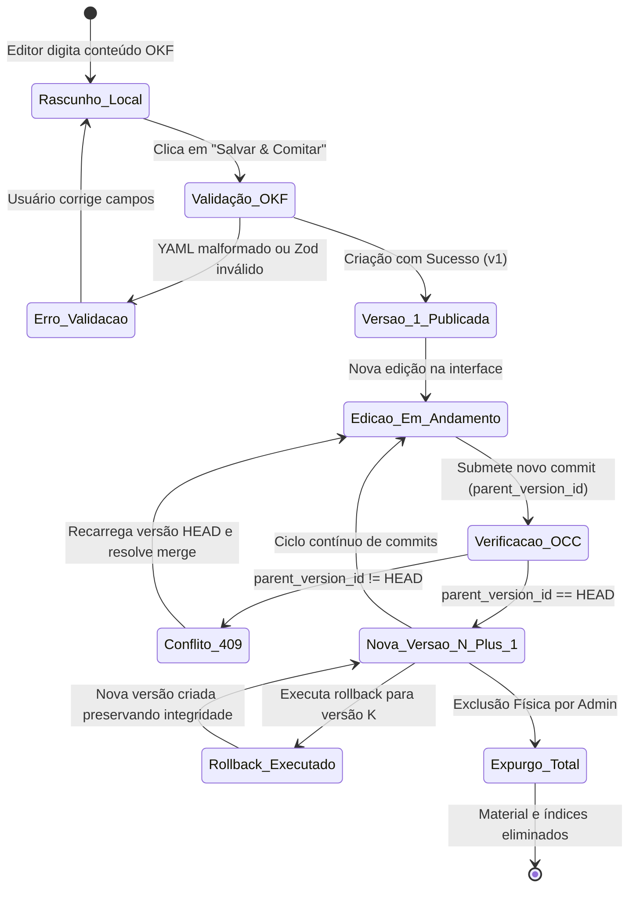

# DOM-OVERVIEW-001: Visão Geral do Domínio de Negócio: Docs-Wiki

> **Resumo Executivo:** Estabelece os limites de domínio, entidades ubíquas, regras de transição de estado e papéis de negócio na plataforma Docs-Wiki.

## 🎯 Visão Geral
O domínio central da plataforma compreende três subsistemas de alto valor:
1. **Gestão de Documentos OKF e Versionamento**: Representação de materiais técnicos compostos por Frontmatter YAML padronizado e corpo em Markdown, governados por uma máquina de estados linear e controle de versão imutável com rastreabilidade criptográfica por SHA-256.
2. **Identidade e Autorização (IAM / RBAC)**: Gestão de usuários baseada em papéis (`LEITOR`, `EDITOR`, `ADMIN`) com proteção contra auto-exclusão e exclusão de contas mestres protegidas pelo sistema (`is_system_protected`).
3. **Indexação Semântica e Grounding RAG**: Extração contínua de conhecimento, decomposição em chunks estruturados por seções e aterramento de respostas de IA em materiais selecionados.

---

## 📐 Detalhes Técnicos e Contratos

### Máquina de Estados do Ciclo de Vida do Material

### Entidades do Domínio e Agregados

* **Material (`conteudo.materiais`):** Raiz do agregado de conteúdo. Contém metadados de catálogo (`titulo`, `slug`, `tipo`, `categoria`, `tags`, `autor`), referência à versão ativa (`versao_head_id`) e status de publicação.
* **Versão de Material (`conteudo.material_versoes`):** Entidade imutável que registra o snapshot completo do arquivo OKF, número sequencial da versão (`versao_num`), referência ao commit pai (`parent_version_id`), mensagem de commit, autor e hash criptográfico SHA-256.
* **Índice de Busca Pai (`busca.indices_busca`):** Representação do documento consolidado com vetor textual TSVector pré-calculado em português para busca BM25.
* **Fragmento Semântico (`busca.material_chunks`):** Segmento do Markdown estruturado por seção com vetor denso `vector(768)` indexado com HNSW.

---

## 🧪 Estratégia de Teste e Validação
As regras de transição de estado e integridade de domínio são validadas através de suítes de testes unitários em:
* `packages/shared/src/dtos/__tests__/material.dto.test.ts`
* `services/content/src/services/__tests__/gitLike.service.test.ts`

---

## 📚 Citations
[1] [Domain-Driven Design: Tackling Complexity in the Heart of Software (Eric Evans)](https://www.domainlanguage.com/ddd/)  
[2] [Optimistic Concurrency Control Patterns (Martin Fowler)](https://martinfowler.com/eaaCatalog/optimisticOfflineLock.html)  

---

## 🔗 Conexões no Grafo (Dependências)
* **Regras Detalhadas:** [Regras de Negócio](./regras-de-negocio.md)
* **Fluxogramas:** [Fluxos de Valor Mermaid](./fluxogramas.md)
* **Serviço Backend:** [GitLikeService](../backend/services/git-like-service.md)
