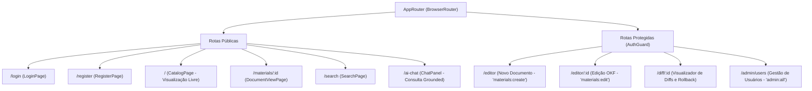

# FE-OVERVIEW-001: Visão Geral da Arquitetura Frontend: SPA React 19

> **Resumo Executivo:** Apresenta a arquitetura de componentes, design system Tailwind com Glassmorphism, paleta HSL, fluxo de dados reativo e sanitização XSS do Frontend Docs-Wiki.

## 🎯 Visão Geral
O Frontend do **Docs-Wiki** é uma Single Page Application (SPA) reativa e fluida, construída sobre o ecossistema React 19.0.0 com Vite 6.0.7. O projeto adota uma estética visual refinada baseada em **Dark Mode nativo, efeitos de Glassmorphism (backdrop-blur), bordas sutis com gradientes e micro-animações suaves** para feedback de ação.

### Pilares de Design e UX:
1. **Design System com Tokens Customizados:** Paleta de cores moderna com tons de ardósia/chumbo (`slate-900`, `slate-800`, `slate-700`) e realces em ciano e índigo (`cyan-500`, `indigo-500`).
2. **Glassmorphism:** Uso de classes utilitárias como `bg-slate-900/70 backdrop-blur-md border border-slate-800/80` em modais, cabeçalhos e cartões de conteúdo.
3. **Desacoplamento por Features:** Organização modular em pastas verticais (`features/auth`, `features/catalog`, `features/editor`, `features/diff`, `features/rag`, `features/admin`).
4. **Gerenciamento de Estado Duplo:** Separação estrita entre Estado de Servidor (React Query) e Estado de Interface (Zustand).
5. **Segurança XSS Inerente:** Sanitização sistemática de HTML/Markdown via biblioteca `DOMPurify` antes de qualquer injeção de markup rico.

---

## 📐 Detalhes Técnicos e Contratos

### Árvore de Roteamento da Aplicação (`App.tsx`)



---

## 🧪 Estratégia de Teste e Validação
A suíte de frontend conta com 19 testes automatizados com React Testing Library:
```bash
npm run test:frontend
```

---

## 📚 Citations
[1] [TailwindCSS Documentation & Custom Tokens](https://tailwindcss.com/docs)  
[2] [Glassmorphism in Modern UI Design (CSS-Tricks)](https://css-tricks.com/glassmorphism-css/)  
[3] [React Testing Library Best Practices](https://testing-library.com/docs/react-testing-library/intro/)  

---

## 🔗 Conexões no Grafo (Dependências)
* **Design System:** [Design System Tailwind & Glassmorphism](./components/design-system-tailwind.md)
* **Componente OKF Editor:** [OKFEditor](./components/okf-editor.md)
* **Componente Diff Viewer:** [DiffViewer](./components/diff-viewer.md)
* **Componente RAG Selector:** [DocumentSelector](./components/document-selector.md)
* **Guarda de Rotas:** [AuthGuard](./components/auth-guard.md)
* **Cliente HTTP:** [API Client](./services/api-client.md)
