# INDEX-ROOT-001: Docs-Wiki: Grafo de Conhecimento Raiz

> **Resumo Executivo:** O Grafo de Conhecimento Raiz mapeia todas as dimensões arquiteturais, de domínio, código, design system, infraestrutura e suíte de testes da plataforma Docs-Wiki.

## 🎯 Visão Geral
A plataforma **Docs-Wiki** é um sistema completo de gestão de conhecimento técnico, documentação estruturada no formato **OKF (Open Knowledge Format)**, versionamento imutável com rastreabilidade criptográfica estilo Git, busca híbrida de alta precisão ($0.3 \times \text{BM25} + 0.7 \times \text{Cosine HNSW}$) e assistente contextual baseado em **RAG (Retrieval-Augmented Generation)** integrado à API Google Gemini.

Esta Wiki foi estruturada segundo o [Guia de Estilo OKF](./OKF_STYLE_GUIDE.md), garantindo atomicidade, rastreabilidade bidirecional e indexação otimizada para desenvolvedores e agentes de IA.

---

## 🗺️ Mapa do Grafo de Conhecimento

```mermaid
graph TD
    Root["🧭 wiki/index.md (Grafo Raiz)"] --> Overview["🌐 Visão Global (overview.md)"]
    Root --> Domain["🏛️ Domínio e Negócio (domain/)"]
    Root --> Frontend["⚛️ Frontend SPA (frontend/)"]
    Root --> Backend["⚙️ Backend Services (backend/)"]
    Root --> Infra["🛡️ Infraestrutura e CI/CD (infra/)"]
    Root --> Testing["🧪 Testes e Qualidade (testing/)"]

    Domain --> D_Rules["Regras de Negócio e OCC"]
    Domain --> D_Flows["9 Fluxogramas Detalhados"]

    Frontend --> FE_DS["Design System & Glassmorphism"]
    Frontend --> FE_Comp["Componentes UI"]
    Frontend --> FE_Serv["Stores e HTTP Client"]

    Backend --> BE_API["Endpoints Compilados"]
    Backend --> BE_Serv["Serviços de Domínio"]
    Backend --> BE_Mod["DTOs e Schemas Zod"]

    Infra --> INF_Docker["Docker & Gateway NGINX"]
    Infra --> INF_CICD["CI/CD LTS e Observabilidade"]

    Testing --> T_Backend["88 Testes Backend"]
    Testing --> T_Frontend["19 Testes Frontend RTL"]
    Testing --> T_OCC["Testes de Concorrência OCC"]
```

---

## 📂 Diretórios e Subdomínios Detalhados

### 1. [🌐 Visão Geral da Arquitetura (overview.md)](./overview.md)
Análise arquitetural aprofundada, visão do monorepo, contratos de comunicação ponta a ponta e alinhamento com as melhores práticas da indústria.

### 2. [🏛️ Domínio e Regras de Negócio (domain/)](./domain/overview.md)
* [Regras de Negócio e Concorrência](./domain/regras-de-negocio.md): Especificação OKF, hash SHA-256, controle de concorrência otimista (OCC), isolamento de transações e políticas de acesso.
* [Fluxogramas de Negócio](./domain/fluxogramas.md): Catálogo completo com os 9 fluxos de valor da plataforma detalhados em Mermaid com análise técnica de branches e loops de recuperação.

### 3. [⚛️ Frontend SPA (frontend/)](./frontend/overview.md)
* **Design System & Estética**: [Design System Tailwind & Glassmorphism](./frontend/components/design-system-tailwind.md) (paleta HSL, glassmorphism, micro-animações, tipografia).
* **Componentes**: [OKFEditor](./frontend/components/okf-editor.md), [DiffViewer](./frontend/components/diff-viewer.md), [DocumentSelector](./frontend/components/document-selector.md), [AuthGuard](./frontend/components/auth-guard.md).
* **Serviços**: [API Client](./frontend/services/api-client.md), [Chat Store](./frontend/services/chat-store.md).

### 4. [⚙️ Microsserviços Backend (backend/)](./backend/overview.md)
* **Endpoints**: [Endpoints Compilados](./backend/api/endpoints-compilados.md) (todas as rotas detalhadas), [IAM API](./backend/api/iam-endpoints.md), [Content API](./backend/api/content-endpoints.md), [Search API](./backend/api/search-endpoints.md).
* **Serviços**: [GitLikeService](./backend/services/git-like-service.md), [NLPService](./backend/services/nlp-service.md), [HybridSearchService](./backend/services/hybrid-search-service.md), [RAGChatService](./backend/services/rag-chat-service.md), [IAMAuthService](./backend/services/iam-auth-service.md).
* **Modelos**: [Database Schemas](./backend/models/database-schemas.md), [Material DTOs](./backend/models/material-dto.md), [Search DTOs](./backend/models/search-dto.md), [Auth DTOs](./backend/models/auth-dto.md).

### 5. [🛡️ Infraestrutura e Deploy (infra/)](./infra/overview.md)
* [Docker Compose Staging](./infra/docker/docker-compose-staging.md) / [Gateway NGINX e Borda OWASP](./infra/docker/nginx-reverse-proxy.md).
* [Pipeline CI/CD e Releases LTS](./infra/CI/cicd-lts-pipeline.md) (análise de vantagens e desvantagens de self-hosted runners) / [Topologia de Observabilidade Isolada](./infra/CI/observability-topology.md).

### 6. [🧪 Testes e Qualidade (testing/)](./testing/overview.md)
* [Suíte de 88 Testes de Backend](./testing/test-cases/unit-e2e-backend.md).
* [Suíte de 19 Testes Frontend com React Testing Library](./testing/test-cases/frontend-rtl-tests.md).
* [Testes de Integração e Concorrência Otimista (OCC)](./testing/test-cases/integration-concurrency-tests.md).

---

## 🔗 Conexões no Grafo (Dependências)
* **Visão Geral Integrada:** [overview.md](./overview.md)
* **Log de Modificações:** [log.md](./log.md)
* **Guia de Estilo:** [OKF_STYLE_GUIDE.md](./OKF_STYLE_GUIDE.md)
