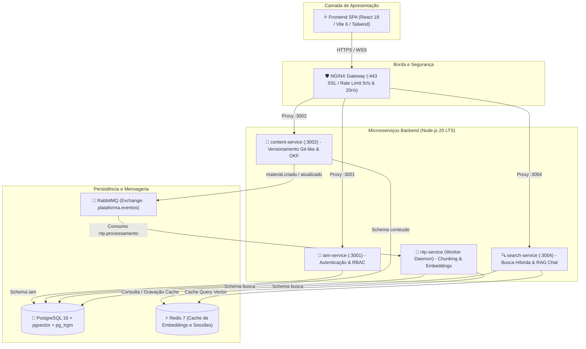

# ARCH-OVERVIEW-001: Visão Geral da Arquitetura do Sistema Docs-Wiki

> **Resumo Executivo:** Documento consolidado com a análise profunda da arquitetura em microsserviços, contratos compartilhados, persistência poliglota e busca híbrida do Docs-Wiki.

## 🎯 Visão Geral
A plataforma **Docs-Wiki** foi concebida como uma arquitetura orientada a serviços desacoplados organizados em um **Monorepo NPM Workspaces** com tipagem estrita de ponta a ponta via TypeScript 5.4.5. O sistema resolve o problema de gestão de conhecimento técnico descentralizado, fornecendo versionamento imutável de documentos (estilo Git), busca vetorial combinada com busca full-text léxica e assistência por inteligência artificial contextual (RAG) sem alucinações.

---

## 📐 Detalhes Técnicos e Contratos

### Topologia de Serviços do Monorepo

### Isolamento de Bancos de Dados por Schemas
O banco PostgreSQL 16 é particionado logicamente em 3 esquemas isolados com usuários de menor privilégio:
1. **`iam`** (`iam_user`): Gerencia `users`, `roles`, `permissions`, `user_roles` e `role_permissions`.
2. **`conteudo`** (`content_user`): Gerencia `materiais` e o histórico imutável `material_versoes`.
3. **`busca`** (`search_user`): Gerencia `indices_busca` (com `tsvector`) e `material_chunks` (com vetores `vector(768)` indexados por HNSW com operador de cosseno).

### Fórmula da Busca Híbrida Ponderada
$$\text{Relevância} = 0.3 \times \text{Score BM25 (ts\_rank\_cd)} + 0.7 \times \text{Similaridade Cosseno (1 - embedding \Leftrightarrow query)}$$

---

## 🧪 Estratégia de Teste e Validação
A suíte do monorepo é composta por mais de 107 testes automatizados executados via scripts:
* **Backend:** `npm run test:backend` (88 testes de integração herméticos com bancos de dados em memória e supertest para todas as APIs).
* **Frontend:** `npm run test:frontend` (19 testes de componentes React com React Testing Library e mocks de contexto).

---

## 📚 Citations
[1] [Open Knowledge Foundation - OKF Specifications](https://okfn.org/)  
[2] [PostgreSQL pgvector Extension Manual](https://github.com/pgvector/pgvector)  
[3] [OWASP ASVS 4.0 - Authentication & Session Management](https://owasp.org/www-project-application-security-verification-standard/)  
[4] [Google Generative AI SDK Reference](https://ai.google.dev/docs)  

---

## 🔗 Conexões no Grafo (Dependências)
* **Mapa Raiz:** [Grafo de Conhecimento](./index.md)
* **Domínio:** [Visão Geral de Domínio](./domain/overview.md)
* **Frontend:** [Visão Geral Frontend](./frontend/overview.md)
* **Backend:** [Visão Geral Backend](./backend/overview.md)
* **Infraestrutura:** [Visão Geral de Infraestrutura](./infra/overview.md)
* **Qualidade:** [Visão Geral de Testes](./testing/overview.md)
