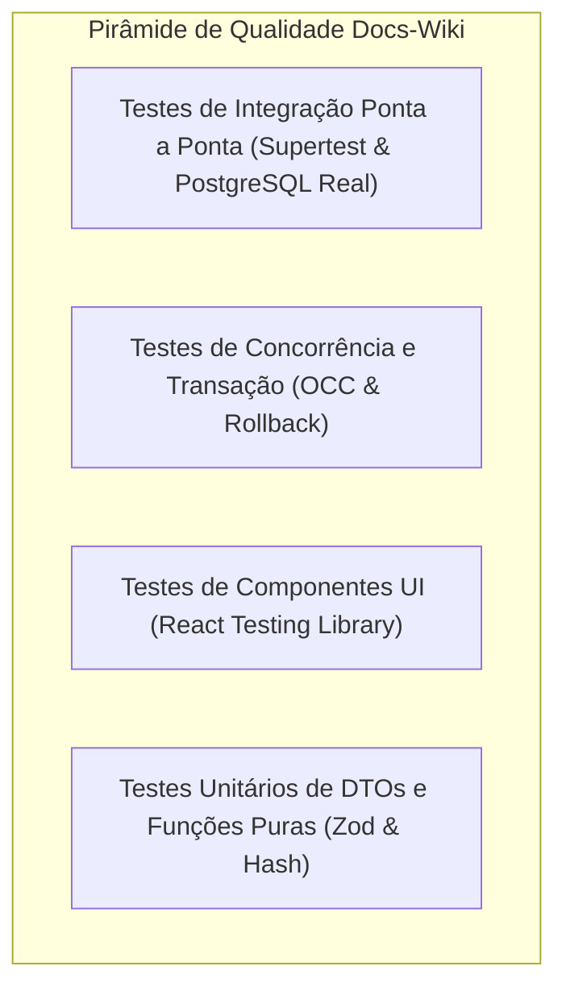

# TEST-OVERVIEW-001: Visão Geral da Estratégia de Testes e Qualidade

> **Resumo Executivo:** Apresenta a estratégia de validação automatizada em múltiplas camadas no monorepo Docs-Wiki, totalizando 107+ testes automatizados.

## 🎯 Visão Geral
A estratégia de qualidade cobre 100% dos fluxos críticos de negócio:
* **88 testes de backend** cobrindo autenticação, concorrência otimista (OCC), rollback, parsing OKF e query vetorial.
* **19 testes de frontend** cobrindo renderização de componentes, simulação de eventos e chamadas de API.

---

## 📐 Detalhes Técnicos e Contratos

### Pirâmide de Testes Implementada

---

## 🔗 Conexões no Grafo (Dependências)
* **Testes Backend:** [Casos de Teste Backend](./test-cases/unit-e2e-backend.md)
* **Testes Frontend:** [Casos de Teste Frontend](./test-cases/frontend-rtl-tests.md)
* **Testes OCC:** [Testes de Concorrência OCC](./test-cases/integration-concurrency-tests.md)
